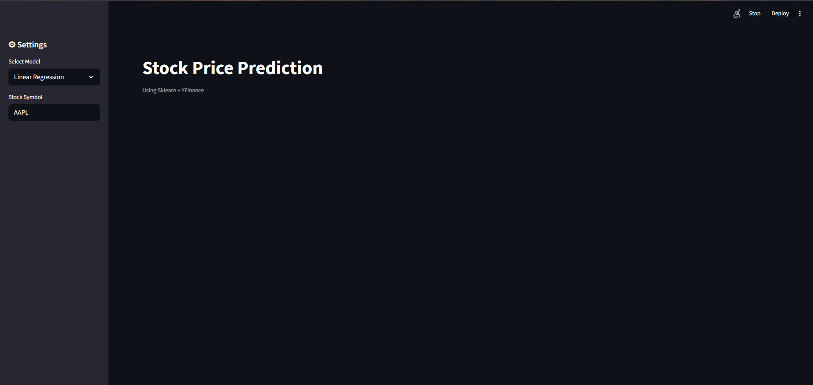
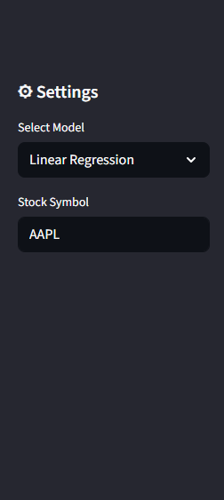
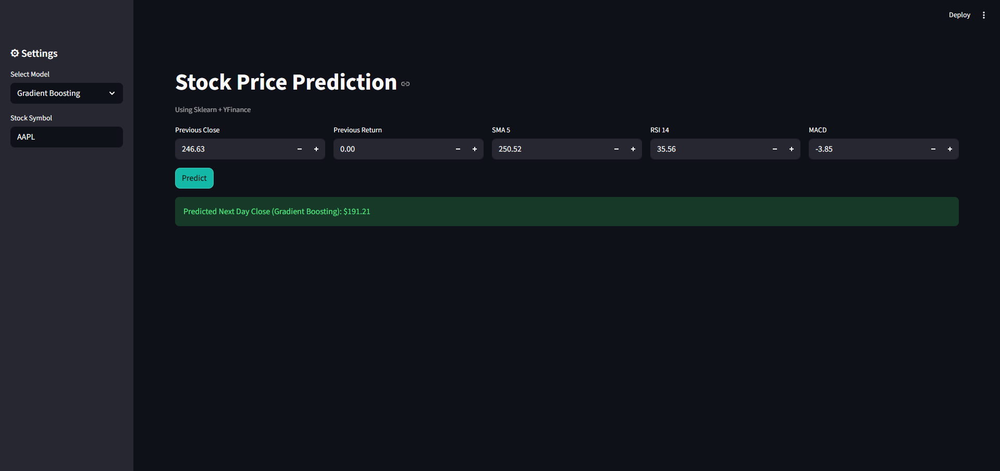

# 📈 Stock Price Prediction App (Streamlit + Scikit-learn)

A machine learning web application that predicts stock prices using multiple ML models. Built with Streamlit, Scikit-learn, and Yahoo Finance data.

---

## 🚀 Features

- Predict stock prices using:
  - Custom input values
  - Stock ticker symbol (via Yahoo Finance)
- Choose from multiple ML models:
  - Linear Regression
  - Random Forest
  - Support Vector Machine (SVM)
  - Gradient Boosting
- Interactive UI built with Streamlit
- Model comparison capability
- Theme control (light/dark)

---

## 🧠 Models Used

- Linear Regression
- Random Forest Regressor
- Support Vector Regressor (SVR)
- Gradient Boosting Regressor

---

## 📂 Project Structure

```
├── models/
│   ├── gradient_boost.pkl
│   ├── linear.pkl
│   ├── random_forest.pkl
│   ├── scaler.pkl
│   ├── svr.pkl
│
├── screenshots/
│   ├── app_launch.png
│   ├── app_ui.png
│   ├── model_selection_1.png
│   ├── model_selection_2.png
│   ├── theme_toggle.png
│   ├── prediction_result_1.png
│   ├── prediction_result_2.png
│
├── app.py
├── train_models.py
├── requirements.txt
└── README.md
```

---

## 🖼️ Screenshots

### 🔹 App Launch



### 🔹 User Interface


### 🔹 Model Selection



### 🔹 Prediction Result



---

## ⚙️ Installation & Setup

### 1️⃣ Clone Repository

```bash
git clone https://github.com/your-username/streamlit-stock-ml-app.git
cd streamlit-stock-ml-app
```

---

### 2️⃣ Create Virtual Environment

```bash
python -m venv venv
```

Activate it:

**Windows:**

```bash
venv\Scripts\activate
```

**Mac/Linux:**

```bash
source venv/bin/activate
```

---

### 3️⃣ Install Dependencies

```bash
pip install -r requirements.txt
```

---

### 4️⃣ Run the App

```bash
streamlit run app.py
```

---

## 📊 How to Use

1. Open the app in your browser
2. Choose prediction mode:
   - Enter custom values OR
   - Enter stock ticker (e.g., AAPL, TSLA)
3. Select ML model:
   - Linear Regression
   - Random Forest
   - SVM
   - Gradient Boosting
4. Click **Predict**
5. View predicted stock price

---

## 📦 Requirements

- streamlit
- yfinance
- pandas
- pandas-ta
- numpy
- scikit-learn

---

## 💡 Future Improvements

- Add deep learning models (LSTM)
- Improve accuracy with feature engineering
- Deploy on Streamlit Cloud / AWS
- Add real-time stock charts

---

## 👨‍💻 Author

Your Name  
GitHub: https://github.com/your-username

---

## ⭐ If you like this project, give it a star!
